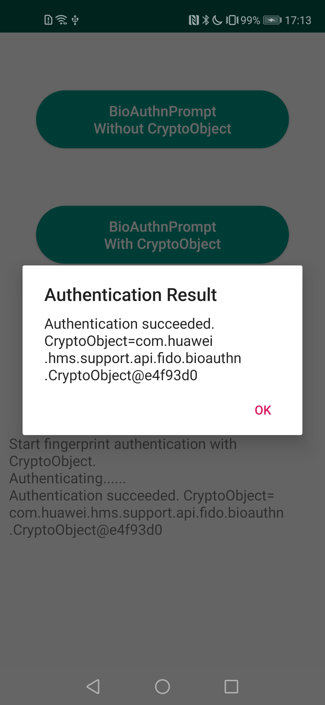

## FIDO BioAuthn Sample

English | [中文](https://github.com/HMS-Core/hms-FIDO-demo-java/blob/master/fido-bioauthn-sample/README_ZH.md)

## Table of Contents

 * [Introduction](#introduction)
 * [Getting Started](#getting-started)
 * [Installation](#installation)
 * [Configuration ](#configuration )
 * [Supported Environments](#supported-environments)
 * [Sample Code](#sample-code)
 * [License](#license)

## Introduction
FIDO BioAuthn Sample provides many sample programs for your reference or usage.

## Getting Started
For more development details, please refer to the following link:

Development Guide: https://developer.huawei.com/consumer/en/doc/development/HMS-Guides/FIDO2_Overview

API References: https://developer.huawei.com/consumer/en/doc/development/HMS-References/BioAuthn_Packagecomhuaweihmssupportapifidobioauthn

We also provide an example to demonstrate the use of BioAuthn SDK for Android.

This sample uses the Gradle build system.

First download the demo by cloning this repository or downloading an archived snapshot.

In Android Studio, use the "Open an existing Android Studio project", and select the directory of "fido-bioauthn-sample".

You should create an app in AppGallery Connect, and obtain the file of agconnect-services.json and add to the project. You should also generate a signing certificate fingerprint and add the certificate file to the project, and add configuration to build.gradle. See the [Configuring App Information in AppGallery Connect](https://developer.huawei.com/consumer/en/doc/development/HMS-Guides/hms-map-configuringinagc) guide to configure app in AppGallery Connect.

Replace "com.huawei.hms.fido.sample.bioauthn" in build.gradle with you own applicationId.

You can use the "gradlew build" command to build the project

## Installation
Before using FIDO BioAuthn Sample code, check whether the java environment and Android Studio have been installed.
Decompress the FIDO BioAuthn Sample code package.

## Supported Environments
Java 1.7 or a later version is recommended.

## Configuration
No additional configuration is required. 

## Sample Code

1). Shows the fingerprint manager without CryptoObject and allows the user to use the device PIN and password for authentication.

2). Shows the fingerprint manager with CryptoObject.

3). Sends a 3D facial authentication request to the user device.

## Result

##  License
FIDO2 Sample is licensed under the [Apache License, version 2.0](http://www.apache.org/licenses/LICENSE-2.0).
