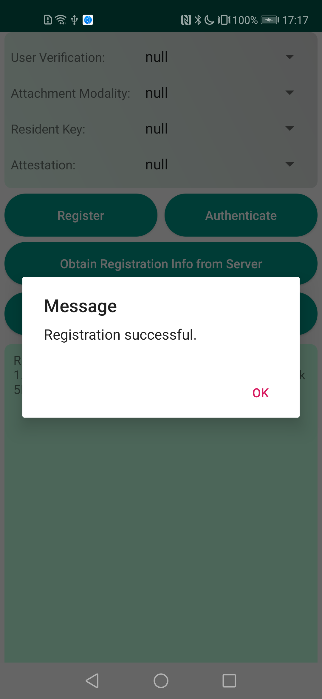
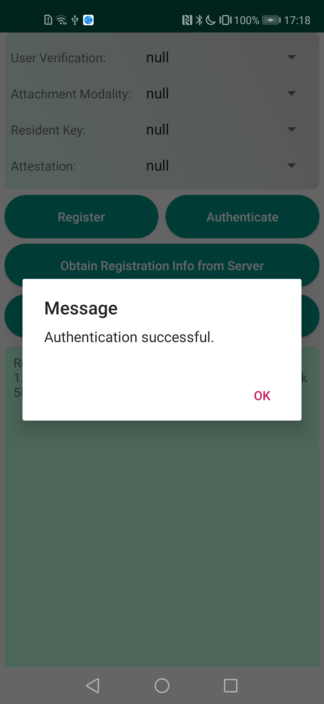

## FIDO2 Sample

中文 | [English](README.md)

## 目录

 * [简介](#简介)
 * [开始](#开始)
 * [安装](#安装)
 * [配置](#配置)
 * [支持环境](#支持环境)
 * [样例代码](#样例代码)
 * [许可证](#许可证)

## 简介
FIDO2 Sample 提供了许多示例代码供参考。

## 开始
更多开发详细信息，请参阅以下链接：

开发指南: https://developer.huawei.com/consumer/cn/doc/development/HMS-Guides/FIDO2_Overview

API参考: https://developer.huawei.com/consumer/cn/doc/development/HMS-References/FIDO2Packagecomhuaweihmssupportapifidofido2

我们还提供了一个示例来演示Android上FIDO2 SDK的使用。

这个示例使用gradle编译。

首先通过克隆此代码库或下载快照来下载演示代码。

在 Android Studio中，使用"Open an existing Android Studio project"，然后选择"fido2-sample"的目录。

您需要在AppGallery Connect中创建一个应用，并获取agconnect-services.json文件并添加到项目中。您还需要生成签名证书指纹并将证书文件添加到项目中，并将配置添加到 build.gradle。请参阅[AppGallery Connect配置](https://developer.huawei.com/consumer/cn/doc/development/HMS-Guides/hms-map-configuringinagc)指南，在 AppGallery Connect中配置应用。

在build.gradle中，使用你自己的applicationId替换掉 "com.huawei.hms.fido.sample.fido2"。

你可以使用"gradlew build"命令来构建你的项目。

## 安装
在使用FIDO2 Sample代码前，请检查你的java开发环境Android Studio是否安装。
解压FIDO2 Sample代码zip包。

## 支持环境
推荐使用Java 1.7及以上版本。

## 配置
无需更多配置。

## 样例代码

FIDO2 包含两个操作: 注册和认证。这两个操作的过程类似。

1）. 创建一个activity。

2）. 从 FIDO 服务器获取挑战值和相关策略，并启动请求。

3）. 调用Fido2Client.getRegistrationIntent() 启动注册， 或调用 Fido2Client.getAuthenticationIntent() 启动认证。

4）. 在callback中调用 Fido2Intent.launchFido2Activity() 来启动注册（requestCode是Fido2Client.REGISTRATION_REQUEST）或启动认证（requestCode是Fido2Client.AUTHENTICATION_REQUEST）。回调将在主线程中执行。

5）. 在Activity.onActivityResult()中调用Fido2Client.getFido2RegistrationResponse()或Fido2Client.getFido2AuthenticationResponse()以获取注册或认证结果。

6） 将注册或认证结果发送到 FIDO 服务器进行验证。

## 结果

## 许可证
此示例代码已获得[Apache 2.0 license](http://www.apache.org/licenses/LICENSE-2.0)。
